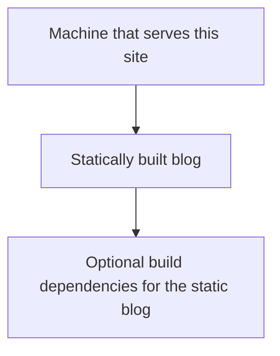

+++
title = "This blog as a Nix derivation"
date = 2023-10-08T19:06:57+01:00
draft = false
tags = ['nix']
+++

Abandon all irreproducibility, ye who enter
---

Those past couple of months, I've been sucked deeper and deeper into the Nix wormhole. At its core, the idea of Nix is simple, it builds repeatable outputs from fixed inputs, from this simple concept comes a package and dev environment manager, an OS, and a DSL to write everything.

As I was thinking about the idea of starting this blog, I got drawn into the idea of writing it as a nix derivation. If it is then surely it can be written as an input of another derivation, the machine that runs the blog. 




# Building the blog

The blog is currently hosted on Github and can be found [here](https://github.com/ldenefle/blog.lunef.xyz/). It's a pretty classic statically compiled blog using hugo. I'm defining nix build files in a [flake](https://nixos.wiki/wiki/Flakes). They're a relatively new feature in the nix ecosystem that are designed to increment reusability among various other things. Personnaly I like to use them to avoid rewriting nix build recipes: the nix description of how to build the blog reside along the blog code, it feels nicer.

The most important part of the flake is the blog derivation 

```nix
blog = pkgs.stdenv.mkDerivation {
  inherit name;
  inherit version;
  src = ./.;

  buildPhase = ''
      cp -r $src/* .
      ${pkgs.hugo}/bin/hugo --config hugo.toml
  '';

  installPhase = ''
      mkdir -p $out
      cp -r public/* $out/
  '';
};
```

We define our blog as a `derivation`, one of nix's core concepts. This derivation defines two phases: 
+ the buildPhase: it copies files our previously defined `src` directory (which is just the root directory of the project) to our build directory and run hugo, it's interesting to note that by calling a pkgs derivation directly like we do here, it gets automatically built and added as a build dependency.
+ the installPhase: we create a directory in the nix store named after our derivation name and a hash of all its inputs, then copy the hugo output directory `public` in it.

Running `nix build .` produces a `result` directory that symlinks us to the build asset produced by nix, a directory in the store containing the hugo generated files.

# Building the site

The site build recipes are hosted [here](https://github.com/ldenefle/flake-configs). I'm running this blog from a machine that runs several services for me, with the idea that I might have to upgrade one day (which should be trivial now that the machine configuration is nixified).

The `flake-configs` project is quite dense and does a lot of things. I will just focus now how the blog is handled.

## Specifying a dependency

Flakes allow us to specify other flakes as inputs, we're doing that with:

```nix
inputs = {
  nixpkgs.url = "github:NixOS/nixpkgs/release-23.11";
  flake-utils.url = "github:numtide/flake-utils";
  sops-nix = {
    url = "github:Mic92/sops-nix";
    inputs.nixpkgs.follows = "nixpkgs";
  };

  blog = {
    url = "github:ldenefle/blog.lunef.xyz";
    inputs.nixpkgs.follows = "nixpkgs";
  };
};
```

Here we define the `nixpkgs` dependency first, that will let us use all the pkgs already defined by the [nixpkgs](https://github.com/NixOS/nixpkgs) project. Noticed that we pin the release `23.11`, to make sure our dependencies don't suddenly change.

Then, we define the `blog` dependency, and we make sure that the `flake.nix` in the `blog` project will use the same set of dependency, so we use the `follows` attribute to override the `nixpkgs` inputs in `blog`.

This lets us have a variable `blog` in the `flake-configs` flake file that will expose its outputs.

We can use the repl to explore a bit what the blog attributes actually is.

In `flake-configs` root directory we can open a repl with `nix repl`

Then we load the current flake with `:lf .` (read load flakes .)

The variables `inputs` is now available in the repl, the use of tabs is recommended to get auto-complete and dig around what the attribute expose. We can even build the blog directly by using `:b inputs.blog.packages.x86_64-linux.default` (the `x86_64-linux` might depend on your system).

After leaving the repl there is now a `result` directory which is the same hugo outputs that we built earlier.

## Creating the system

Every machine that I manage have a configuration in the `hosts` directory. The machine that serves this blog is named `sirocco` and it's configuration can be found [here](https://github.com/ldenefle/flake-configs/blob/main/hosts/sirocco/default.nix).

I use `caddy` to handle https certificate and reverse proxy my services. For the blog creating the system is as simple as 
```nix
{ config, inputs, system, modulesPath, ... }:

let
  blog = inputs.blog.packages."${system}".default;
in {
  imports = [ "${modulesPath}/virtualisation/digital-ocean-image.nix" ];

  services.caddy = {
    enable = true;
    virtualHosts."blog.lunef.xyz".extraConfig = ''
      encode gzip
      file_server
      root * ${blog}
    '';

  };

  networking.firewall = {
    enable = true;
    allowedTCPPorts = [ 80 443 ];
  };

  networking.hostName = "sirocco";
}
```

I removed a lot of fat from the original machine configuration as it's not required for the blog handling. 

Several things happen here: 
+ I create a `blog` variable that refers to the default package for my current system of the `blog` flake, it's the same derivation that we built earlier from the repl.
+ I import a module that will set some sane defaults for a digital ocean image, where the machine is currently hosted.
+ I enable the `caddy` service, and setup a virtual host that just expose a file_server whose root __is the output of the compiled blog derivation__, again by just invoking it in the services, nix will automatically build it.
+ I set some networking variables to set a hostname for the machine and open ports 80 and 443.

The machine is buildable as my flake specify it as a an output `nixosConfiguration`.

```nix
nixosConfigurations = {
      sirocco = mkSystemx86 [ ./hosts/sirocco ];
    };
```

To build the machine configuration, all I have to do is 
```nix
nix build .#nixosConfigurations.x86_64-linux.sirocco.config.system.build.toplevel
```

Then push the output `./result` directory to the machine using 
```bash
nix copy --to ssh://${HOST} ./result
```

And rebuild the remote nixos with 
```bash
ssh ${HOST} nix-env -p /nix/var/nix/profiles/system --set $(readlink ./result)
ssh ${HOST} /nix/var/nix/profiles/system/bin/switch-to-configuration switch
```

I added a `deploy` script in `flake-configs` to automate the task.


