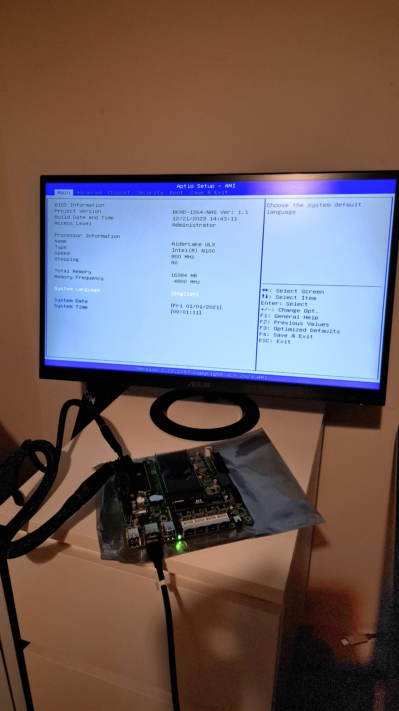
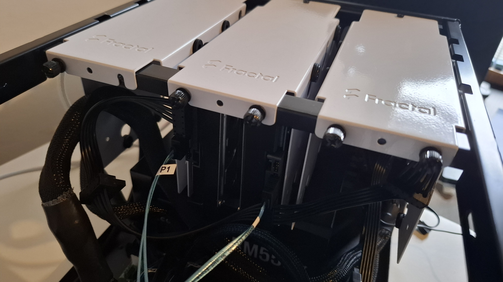
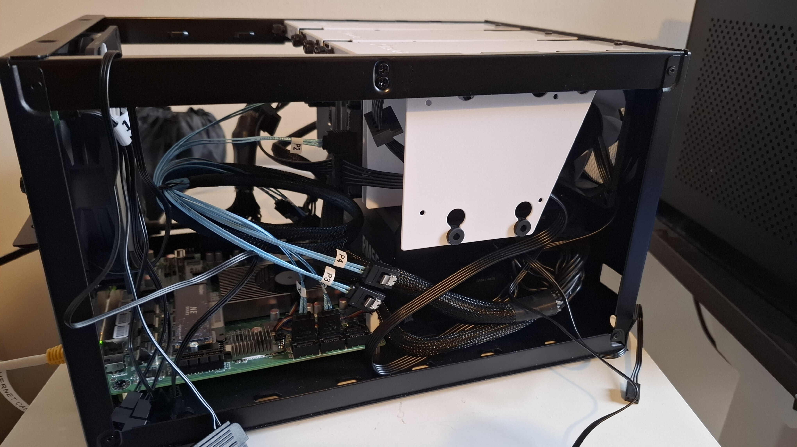
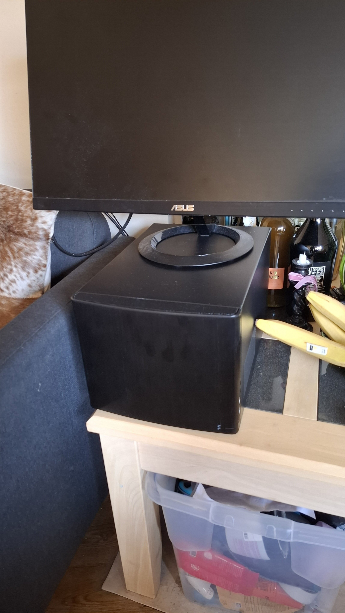

+++
title = "Building a low power NAS"
date = 2025-03-08T10:00:00+01:00
draft = false
tags = ['nix', 'hardware']
+++

I've been considering getting a nas for a while now, the data hoarder part of me drewls internally at the idea of all that available storage.

I had a couple of requirements for the nas:
+ **low power**, after all besides the environmental aspect which can't be great regardless of the power consumption of the rig, I wanted to lower monthly costs as much as possible
+ **redundancy**, what a great occasions to start learning about openzfs
+ **extensibility**, I didn't have a strong idea of the high watermark of the volume of data I was going to store, so I wanted to potentially grow my pool of drives as time went on
+ **declarative**, It needed to have a configuration as declarative as reasonably possible, good thing I'm already a nixos fanboy
+ **cheap**, I live in London and pints are expensive

## Hardware

### Waiting for mobo

I looked at hardware for a *while*. I want through several mental iterations of what the architecture could be including:
+ a raspberry pi with a 4xssd [shield](http://radxa.com/products/accessories/penta-sata-hat/), it even comes with a [cute 3d printable little enclosure](https://makerworld.com/en/models/895460-radxa-penta-sata-hat-nas-enclosure#profileId-853279)
+ a [RK3588 board](https://www.friendlyelec.com/index.php?route=product/product&product_id=294) with 4xm.2 pcie slot for nvme ssds

Early in my research I came to the (obvious?) conclusion that while SSD are much less power hungry the price per GB was a real deal breaker, and I knew that I needed a large datapool in order to implement my redundancy requirement.

I also relinquished the idea of using a non-x86 platform such as arm, for the reason that deployment and management of the os would be more painful. I was set at that point on using nixos and although cross compilation is supported, it is a **pain**.

So at that point I had a blurred picture of an intel machine (**declarative**) with a lot of sata ports (**redundancy, extensibility**), I could just make a rig from parts but it won't be **cheap** and common modern processors are not **low power** at all.

After dwelling the internet corners that talked about low power nas (including the very based [@Wolgang's Channel](https://www.youtube.com/@WolfgangsChannel)), I found the [Intel N100](https://www.intel.com/content/www/us/en/products/sku/231803/intel-processor-n100-6m-cache-up-to-3-40-ghz/specifications.html), a intel low power chip with a promising TDP of only 6W.

A quick search on amazon showed that this processor was mostly used for mini-pc, with the occasional motherboard around 180£. Ok, that's good but I'm sure it can be less, let's go to Aliexpress, and bingo [a N100 6xsata mobo for 94£](https://vi.aliexpress.com/item/1005007125716127.html). After short hesitation due to some apprehensions buying from Aliexpress, I took the leap of faith. In insight, my experience was quite positive overall in spite of some initial challenges with the website (impossibility to pay with my normal Monzo credit card for some reasons), the tracking and the shipping time were okay, I expected some customs difficulty like a suprise fee on reception of the package but everything went well.

Now that I had a mobo and a CPU I needed a PSU, some RAM and some cheap boot storage. I found the cheapest options on amazon for a 16GB ram DDR5 stick and a 500GB nvme ssd. The PSU was a bit more of a headscratch, I wanted something cheap, I didn't need a lot of power but I needed the PSU to be efficient at very low wattage, which is not a given at all as most PSUs are optimized for high draw. @Wolfgang's Channel has a very useful [PSU Low Idle Efficiency Database](https://docs.google.com/spreadsheets/u/1/d/1MBZvyDiXm2x3Xlltdt6yCadOv6XpsgdN-BkjWOPjDnI/edit?gid=110239702#gid=110239702) spreadsheet that lists different PSUs and their efficiencies with low loads. After inputting several options in ebay I settled for a second hand RM550x for the price of 57.19£, a bit pricy but I was getting impatient at that point.

Fast forward a couple of weeks and everything has been received, after a quick verification of the PSU voltages, I assemble the mobo, ram and ssd, power them and am greeted by a beautiful boot screen.



I grabbed on a usb drive and went on to install a nixos system, added a power monitor in front of the PSU, booted up and idled at a 14W. That's pretty great ! although we don't have any drives attached so it's not very representative of the end system.

### Taking it for a test drive

Talking about drives, I didn't buy storage at this point nor an enclosure. The enclosure had two requirements, it needed to be easy to fit in a living room, have space for a potential 6 hdd pool and space to fit my bulky ATX rm550X PSU. I settled for the fractal node 304, which I bought on amazon for 85£. As a sidenote, I found it quite hard to find second-hand pc enclosures on ebay, I assumed that there would be a strong resell market for enclosures.

Ok, all I needed now was some hdds to fit in my enclosure, but which ones ? I needed to have **redundancy**, **cheap** and **extensible** so I had several constraints:
+ **redundancy**: whatever drives I would buy, I needed at least two of them, the upsides of this was that I could pick some second hand drives with a bit more mileage as failure of one wasn't as critical
+ **extensible**: ZFS pools require size parity between first and future drives, so I wasn't only picking the first drive sizes but all drives from the same pool too
+ **cheap**: knowing the **extensible** constraint if I wanted to have the largest raid array possible, I'd probably the need the largest drives from the get go, but high capacity drives quickly get expensive, especially if you have to buy several of them (**redundancy**)

After watching [diskprices](https://diskprices.com/?locale=uk) for several days and toying with the idea of different capacities I chose to buy two 8TB hdd for 135£. It gives me 7.3 usable TB with a single zfs vdev made of the two drives. The potential future strategy would be to buy three external drives, assembled them in a new pool raid1 with a 16TB capacity, copy the current pool of 7.3TB into the new pool, reformat the old drives and adding them to the pool for a total 24TB capacity.

Upon reception of the drives and the case, I quickly assembled everything, tested that the drives were discovered by the OS.





### Shedding the watts

I expected an increase in power consumption with the disks spinning and sure thing the power jumped to **52W**, that's a whopping multiplication by 3 from the base power. To give an idea of the increased in power bill, I jumped from a mere 3£ a month to keep the nas online at all time to a 9£ month !

My options were limited, considering disks were required only on *rare* access, spinning them down when idle could help save a lot of power. I researched before hand on the real impact of spinning down hard drive disks on the life duration, and got mitigated answers, it seems that there's no conclusive data that indicates that leaving the disk on or powering off and on regularly has any consequences. My 6£ monthly increase bill was however very real, so I started looking into a way to power off disks automatically when idle.

I found the [`hdparm`](https://wiki.archlinux.org/title/Hdparm) utility and added it to my nixos configuration as a udev rules that gets executed when a disk is added.

```
let spinDownMins = minutes: builtins.toString (5 * minutes);
in {
  services.udev.extraRules = let
    mkRule = as: lib.concatStringsSep ", " as;
    mkRules = rs: lib.concatStringsSep "\n" rs;
  in mkRules ([
    (mkRule [
      ''ACTION=="add|change"''
      ''SUBSYSTEM=="block"''
      ''KERNEL=="sd[a-z]"''
      ''ATTR{queue/rotational}=="1"''
      ''RUN+="${pkgs.hdparm}/bin/hdparm -B 90 -S ${spinDownMins 5} /dev/%k"''
    ])
  ]);
}
```

I tested writing on a disk, waited for 5 minutes and sure enough, the power consumption went back down to 17W. The extra power consumption must be coming from some passive draw from the hdd and the added fans of the Fractal cases.


### Total cost of the build

| Components | Price (£) |
|-|-|
| Mobo + CPU | 104 |
| RAM 16GB | 39 |
| SSD | 30 |
| Case | 85 |
| PSU | 57 |
| HDD 8TB | 135 |
| HDD 8TB | 135 |
| **Total** | **585** |

I paid a total of 585£ which was around what I initially assumed, I think now that some parts like the PSU and the case could have been further cost optimized with more effort. It's hard to beat the price of the motherboard, ram and ssd at this point. As for the HDDs, I'm still not sure if there is a more optimized way of getting cheap drives than `diskprices` in the UK. I know the US has `serverpartdeals`, which I would totally have used if the shipping prices weren't what they are.

The performance are really good so far, the little machine handle transcoding very well on Jellyfin and the power consumption is satisfying, you can find my nixos configuration files on my [github](https://github.com/ldenefle/flake-configs/tree/main/hosts/tramontane).


